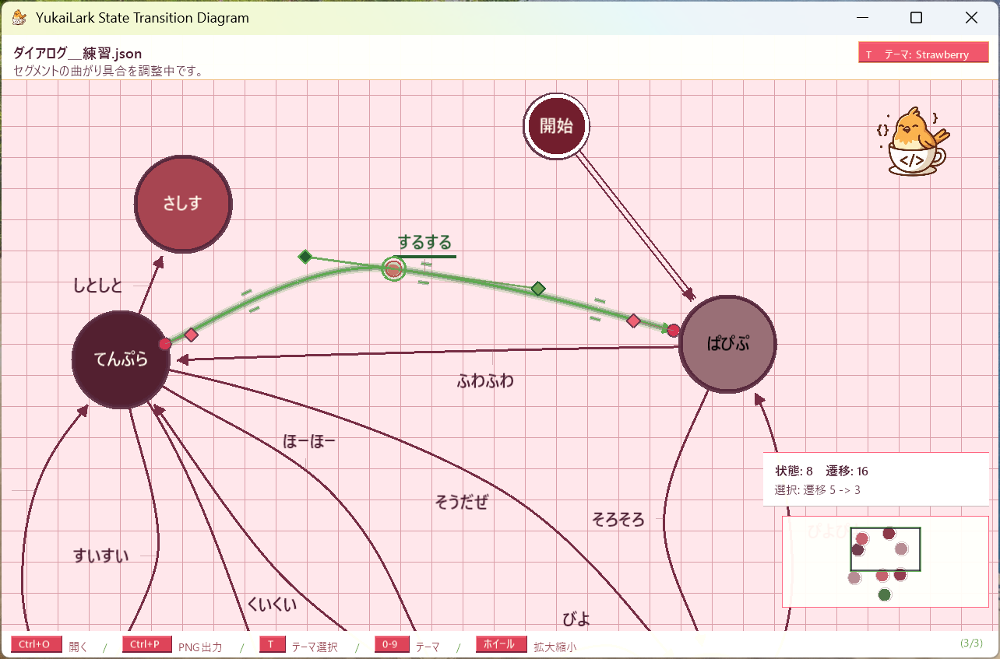

# YukaiLarkStateTransitionDiagram

これは、AI エージェントにアプリケーションの作成をお願いすることになったときに、説明を上手く伝えることを助けるためのツールです。  

人間の頭の中の、アプリケーションはこういうふうに動作してほしい、という考えを、  
このアプリケーション上で整理して、図として出力するツールです。  

状態を円で描き、円を矢印でつなぐことができます。  

</img>  
👆　ユカイラークという鳥のアシスタントが、ツールの使い方を説明します。  

  

👆　スクリーンショット 2026-06-28 16:30 [v1.0.0]  


## ダウンロード

アプリを試す場合は、GitHub Releases から最新版をダウンロードしてください。

- [最新版のリリースページ](https://github.com/muzudho/YukaiLarkStateTransitionDiagram/releases/latest)
- [v1.0.0 のリリースページ](https://github.com/muzudho/YukaiLarkStateTransitionDiagram/releases/tag/v1.0.0)

Windows で使う場合は、リリースページの **Assets** から次のファイルをダウンロードしてください。

- `YukaiLarkStateTransitionDiagram-v1.0.0-win-x64.zip`

ダウンロード後、zip ファイルを展開して、中にある実行ファイルを起動してください。

## 開発日誌

- [最新の月別開発日誌: 2026年6月](YukaiLarkStateTransitionDiagram/Docs/開発/開発日誌_2026-06.md) - 1か月分を1ファイルで読めます。


## できること

- 日本語ラベル付きの状態ノードを作れます。
- 状態から状態への遷移を矢印でつなげます。
- 自己ループも作れます。
- 遷移ラベル、矢印の曲がり方、接点位置を調整できます。
- 状態遷移図を JSON として保存・読込できます。
- 図を PNG 画像として出力できます。

## こんな人向け

- ゲームやアプリの画面遷移を整理したい人
- AI エージェントへ状態遷移を説明するための図を作りたい人
- 日本語で状態名やイベント名を書きたい人
- 軽く動かせる状態遷移図ツールを探している人

## 起動方法

リポジトリー直下で次のコマンドを実行します。

```powershell
dotnet run --project .\YukaiLarkStateTransitionDiagram\YukaiLarkStateTransitionDiagram.csproj
```

Visual Studio から起動する場合は、`YukaiLarkStateTransitionDiagram.slnx` を開いて実行します。

## 基本操作

| やりたいこと | 操作 |
| --- | --- |
| 状態を追加 | `N` |
| 状態や遷移のラベルを編集 | 選択して `F2` または `Enter` |
| 遷移を作成 | `Shift` + 状態から状態へ左ドラッグ |
| 自己ループを作成 | `Shift` + 同じ状態上で左ドラッグして離す |
| 保存 | `Ctrl + S` |
| 開く | `Ctrl + O` |
| PNG画像として出力 | `Ctrl + P` |

詳しい操作は [使い方説明書](YukaiLarkStateTransitionDiagram/Docs/使い方説明書.md) を見てください。

## 必要なもの

- Windows
- .NET SDK
- Visual Studio 2022 または `dotnet` CLI

## ドキュメント

- [使い方説明書](YukaiLarkStateTransitionDiagram/Docs/使い方説明書.md)
- [最新の月別開発日誌: 2026年6月](YukaiLarkStateTransitionDiagram/Docs/開発/開発日誌_2026-06.md)
- [Docs README](YukaiLarkStateTransitionDiagram/Docs/README.md)

## ライセンス

このリポジトリーは [MIT License](LICENSE.txt) です。
