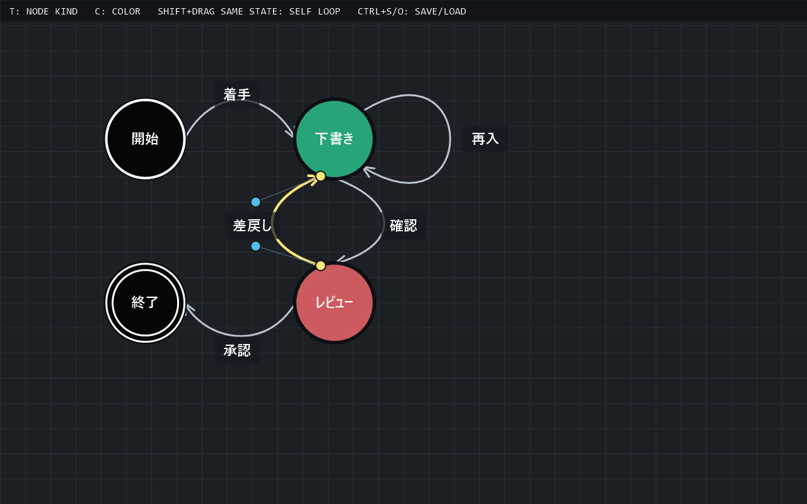

# YukaiLarkStateTransitionDiagram 使い方説明書

YukaiLarkStateTransitionDiagram は、状態と遷移を画面上に並べて、AI エージェントとの相談に使いやすい状態遷移図を作るための MonoGame アプリです。


## 起動する

リポジトリーのトップで次のコマンドを実行します。

```powershell
dotnet run --project .\YukaiLarkStateTransitionDiagram\YukaiLarkStateTransitionDiagram.csproj
```

Visual Studio から起動する場合は、`YukaiLarkStateTransitionDiagram.slnx` を開いて実行します。

## 画面の見方



- 丸い図形が「状態」です。
- 黒い丸は、開始マークまたは終了マークです。

- 状態の中には日本語ラベルを表示できます。

- 状態から状態へ伸びる矢印が「遷移」です。

- 遷移の線は、状態ノードの円周上の接点から接点へ引かれる 3 次ベジェ曲線です。
- 同じ状態へ戻る自己ループは、ノードの外側へ膨らむ楕円風の曲線で表示されます。

- 遷移にも日本語ラベルを表示できます。

- 水平寄りの遷移ラベルは上下に、垂直寄りの遷移ラベルは左右に置けます。

- 背景のグリッドは、状態を並べるときの目安です。

- 画面上部の黒いバーには、現在のファイル名と操作結果が日本語で表示されます。

- 画面右上のパネルには、状態数、遷移数、選択中の部品が表示されます。

- 画面下部の黒いバーには、操作中によく使う補助ショートカットが表示されます。右端にはページ番号が出て、数秒ごとにフェードしながら切り替わります。

- マウスカーソルを状態や遷移へ重ねると、クリックできる対象が薄く強調表示されます。

## 図の部品

| 見た目 | 意味 |
| --- | --- |
|  | このツールのアプリアイコンです。 |
| 青・緑・赤・黄土色などの丸 | 通常の状態ノードを表します。 |
| 黒い丸 | 開始マークまたは終了マークを表します。 |
| 黒い二重丸 | 終了マークを表します。 |
| 白い縁取りの丸 | 選択中の状態です。 |
| 矢印 | 状態から状態への遷移です。 |
| 選択中の遷移の黄色い丸 | 遷移の始点・終点の接点ハンドルです。ドラッグして円周上を動かせます。 |
| 選択中の遷移の青い丸 | 3 次ベジェ曲線の制御点です。ドラッグしてエッジを曲げられます。 |
| 黄色い矢印 | 選択中の遷移です。 |
| 矢印の近くの文字 | 遷移ラベルです。 |
| グリッド線 | 配置の目安です。 |
| マウス下の薄い水色の強調表示 | クリックまたはドラッグできる対象の目印です。 |
| 右上の情報パネル | 状態数、遷移数、選択中の部品を確認できます。 |
| 下部のヘルプバー | よく使う補助操作を確認できます。右端にページ番号が表示され、ゆっくり切り替わります。 |

## 状態を追加する

1. 状態を置きたい場所へマウスカーソルを動かします。

2. `N` キーを押します。

3. マウス位置に新しい状態が追加されます。

追加された状態は自動で選択されます。

## 開始マークを置く

`S` キーを押すと、開始マークが無い場合はマウス位置に開始マークを追加します。

既に開始マークがある場合は、開始マークが画面中央に来るように表示位置を移動します。

## 終了マークを追加する

1. 終了マークを置きたい場所へマウスカーソルを動かします。

2. `E` キーを押します。

3. マウス位置に終了マークが追加されます。

終了マークは二重丸で表示されます。

## 状態ラベルを編集する

1. ラベルを変えたい状態を左クリックします。

2. `F2` キーまたは `Enter` キーを押します。

3. 日本語ラベルを入力します。

4. `Enter` キーで確定します。

編集中に `Backspace` キーを押すと 1 文字削除します。`Esc` キーを押すと編集をキャンセルします。

## 状態を移動する

1. 移動したい状態を左クリックします。

2. 左ボタンを押したままドラッグします。

3. 好きな位置でボタンを離します。

## 遷移を作る

1. 遷移の出発元にしたい状態にマウスカーソルを合わせます。

2. `Shift` キーを押しながら左ドラッグします。

3. 遷移先にしたい状態の上でマウスボタンを離します。

4. 出発元から遷移先へ矢印が作られます。

同じ向きの遷移がすでにある場合は、重複して追加されません。

## 自己ループを作る

1. 自己ループを作りたい状態にマウスカーソルを合わせます。
2. `Shift` キーを押しながら、その状態を左ドラッグします。
3. 同じ状態の上でマウスボタンを離します。
4. 同じ状態へ戻る楕円風の自己ループが作られます。

自己ループも黄色い接点ハンドルと青い制御点ハンドルをドラッグして形を調整できます。

## 遷移ラベルを編集する

1. ラベルを変えたい遷移線の近くを左クリックします。

2. `F2` キーまたは `Enter` キーを押します。

3. 日本語ラベルを入力します。

4. `Enter` キーで確定します。

遷移ラベルも保存時に UTF-8 BOM なしの `diagram.json` に書き込まれます。

開始マークから最初の通常ノードへ入る遷移には、イベントを表す遷移ラベルを付けられません。

## 遷移ラベルの位置を切り替える

1. 位置を変えたい遷移線の近くを左クリックします。

2. `Tab` キーを押します。

水平寄りの遷移では、ラベル位置が上と下で切り替わります。垂直寄りの遷移では、ラベル位置が左と右で切り替わります。

## 遷移の形を曲げる

1. 形を変えたい遷移線の近くを左クリックします。
2. 選択中の遷移に、黄色い丸と青い丸が表示されます。
3. 黄色い丸を左ドラッグすると、始点・終点の接点がノードの円周上を移動します。
4. 青い丸を左ドラッグすると、3 次ベジェ曲線の制御点が移動し、エッジの曲がり方が変わります。

接点位置と制御点位置は保存時に `diagram.json` へ書き込まれます。エッジが重なるときは、同じノードにつながる遷移の接点や制御点を少しずらしてください。

## 選択する

- 状態を左クリックすると、その状態を選択します。

- 遷移線の近くを左クリックすると、その遷移を選択します。

- 選択中の状態は白い縁取りで表示されます。

- 選択中の遷移は黄色で表示されます。

## 色を変える

1. 色を変えたい状態を選択します。

2. `C` キーを押します。

3. 状態の色が次の色に切り替わります。

開始マークと終了マークは黒固定のため、`C` キーでは色が変わりません。状態の色は通常ノードで変更できます。

## キーキャップテーマを切り替える

`0` から `9` の数字キーを押すと、画面下部のショートカット表示に使うキーキャップテーマ、背景グリッド、PNG出力時の写真風フレームが切り替わります。テンキーの `0` から `9` でも同じように切り替えられます。

現在の割り当ては、`0`: Office、`1`: Gaming、`2`: Retro、`3`: CopyPaper、`4`: Girly、`5`: Hokusai、`6`: Monochrome、`7`: Mint、`8`: Amber、`9`: Midnight です。

## 削除する

1. 削除したい状態または遷移を選択します。

2. `Delete` キーまたは `Backspace` キーを押します。

状態を削除すると、その状態につながっている遷移も一緒に削除されます。

## 保存する

`Ctrl + S` を押すと、現在の状態遷移図を JSON ファイルに保存します。

未保存の新規図では保存先を指定するダイアログが開きます。既に保存先が決まっている場合は同じファイルへ上書きします。保存先を変えたいときは `Ctrl + Shift + S` を押してください。保存ファイルは UTF-8 BOM なしで書き込まれます。

## 読み込む

`Ctrl + O` を押すと、読み込む JSON ファイルを選ぶダイアログが開きます。

アプリ起動時はユカイラークがファイルメニューを表示します。`N` で新規作成、`O` で読込、`1` から `9` と `0` で最近保存したファイルを開けます。保存または読み込んだファイルは、`%APPDATA%\YukaiLarkStateTransitionDiagram\config.json` に最近使ったファイルとして最大10件まで記録されます。通常操作中に同じメニューを開くには `Ctrl + R` を押します。

## 新規作成する

`Ctrl + N` を押すと、空の状態遷移図を新規作成します。この時点ではまだファイルには保存されません。保存するときは `Ctrl + S` を押して保存先を指定してください。

## PNG画像として出力する

1. `Ctrl + P` を押します。図全体を包む写真風の範囲枠が自動で表示され、画面上部と下部の操作説明がPNG出力モード用に切り替わります。

2. 必要に応じて範囲枠を調整します。四辺・角をドラッグするとサイズを調整でき、枠の内側をドラッグすると位置を移動できます。範囲枠は半グリッドに吸着し、`Alt` キーを押している間は吸着しません。

3. 範囲が決まったら `Enter` キーを押して撮影します。

4. 保存先を指定すると、選んだ範囲の状態遷移図が PNG 画像として保存されます。保存後、画面にシャッター風のフラッシュと写真風プレビューが短く表示されます。

出力画像には、編集中のハンドルや画面上部・下部の操作バーは入りません。現在選んでいる `0` から `9` のテーマに合わせて、背景グリッド、写真風の余白、ピン止め風の装飾が切り替わります。

PNG出力モード中にやめたい場合は、右クリックまたは `Esc` キーでキャンセルできます。

## 終了する

`Esc` キーを押すとアプリを終了します。

## ショートカット一覧

| 操作 | キー / マウス |
| --- | --- |
| 状態を追加 | `N` |
| 開始マークを追加、または開始マークへ移動 | `S` |
| 終了マークを追加 | `E` |
| 空の新規図を作成 | `Ctrl + N` |
| 状態を移動 | 状態を左ドラッグ |
| 選択中の状態または編集可能な遷移のラベルを編集 | `F2` / `Enter` |
| ラベル編集を確定 | 編集中に `Enter` |
| ラベル編集をキャンセル | 編集中に `Esc` |
| 遷移を作成 | `Shift` + 状態から状態へ左ドラッグ |
| 自己ループを作成 | `Shift` + 同じ状態上で左ドラッグして離す |
| 遷移ラベルの位置を切り替え | 遷移選択中に `Tab` |
| 遷移の接点を移動 | 選択中の遷移の黄色い丸を左ドラッグ |
| 遷移の曲がり方を変更 | 選択中の遷移の青い丸を左ドラッグ |
| 状態または遷移を選択 | 左クリック |
| 選択中の状態の色を変更 | `C` |
| テーマを切り替え | `0` - `9` |
| 選択中の状態または遷移を削除 | `Delete` / `Backspace` |
| 保存 | `Ctrl + S` |
| 名前を付けて保存 | `Ctrl + Shift + S` |
| 読込 | `Ctrl + O` |
| 最近ファイルメニュー | `Ctrl + R` |
| PNG画像として出力 | `Ctrl + P` で自動枠表示、ドラッグで調整、`Alt` で吸着なし、`Enter` で撮影、右クリック / `Esc` でキャンセル |
| 終了 | `Esc` |

## 困ったとき

### 保存した図が見つからない

初回保存時または `Ctrl + Shift + S` で選んだ場所に JSON ファイルが作られます。保存先が分からないときは、もう一度 `Ctrl + Shift + S` で分かりやすい場所へ保存してください。

### 日本語ラベルの入力を始めたい

状態または遷移を選択してから `F2` キーまたは `Enter` キーを押してください。入力が終わったら、もう一度 `Enter` キーで確定します。保存すると、ラベルは UTF-8 BOM なしの JSON ファイルに書き込まれます。

### 遷移線をクリックしにくい

線の近くをクリックすると選択できます。状態が重なっている場合は、状態を少し移動してから遷移線を選択してください。
