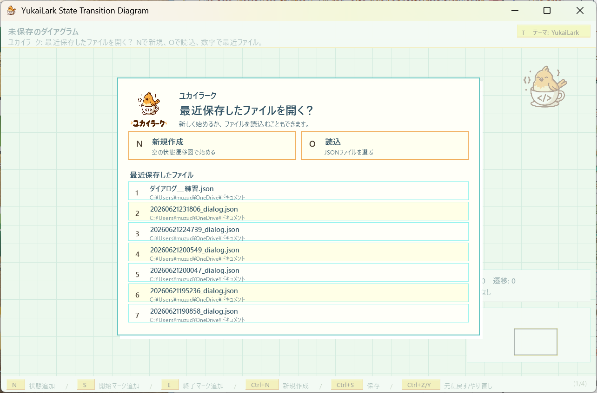
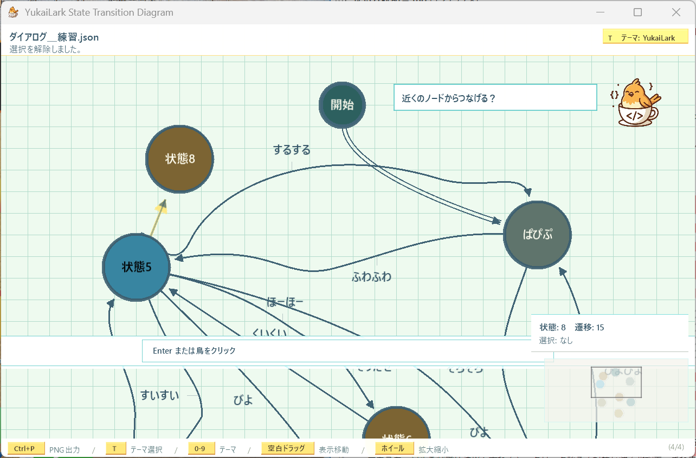
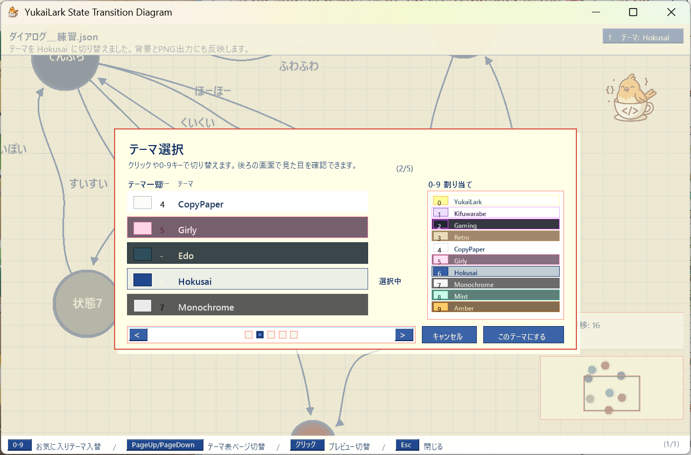

# YukaiLarkStateTransitionDiagram 使い方説明書

YukaiLarkStateTransitionDiagram は、状態と遷移を画面上に並べて、AI エージェントとの相談に使いやすい状態遷移図を作るための MonoGame アプリです。


## 起動する

リポジトリーのトップで次のコマンドを実行します。

```powershell
dotnet run --project .\YukaiLarkStateTransitionDiagram\YukaiLarkStateTransitionDiagram.csproj
```

Visual Studio から起動する場合は、`YukaiLarkStateTransitionDiagram.slnx` を開いて実行します。

## 画面の見方


起動直後は、最近使ったファイルを開くメニューと、ユカイラークの案内が表示されます。



ユカイラークの提案は、`Enter` キーまたは鳥をクリックすると実行できます。不要な提案は `Esc` キーで断れます。



- 丸い図形が「状態」です。

- 黒い丸は、開始マークまたは終了マークです。
- 状態の中には日本語ラベルを表示できます。
- 状態から状態へ伸びる矢印が「遷移」です。
- 遷移の線は、状態ノードの円周上の矢始から矢終へ引かれる曲線です。
- 遷移には中間点を追加でき、折れ曲がる経路を作れます。
- 遷移にも日本語ラベルを表示できます。
- 水平寄りの遷移ラベルは上下に、垂直寄りの遷移ラベルは左右に置けます。
- 背景のグリッドは、状態を並べるときの目安です。
- 画面上部の黒いバーには、現在のファイル名と操作結果が日本語で表示されます。
- 画面右上のパネルには、状態数、遷移数、選択中の部品が表示されます。画面右下にはミニマップが表示されます。
- 画面下部の黒いバーには、操作中によく使う補助ショートカットが表示されます。右端にはページ番号が出て、数秒ごとにフェードしながら切り替わります。
- マウスカーソルを状態や遷移へ重ねると、クリックできる対象が薄く強調表示されます。

## 図の部品

| 見た目 | 意味 |
| --- | --- |
|  | このツールのアプリアイコンです。 |
| 青・緑・赤・黄土色などの丸 | 通常の状態ノードを表します。 |
| 黒い丸 | 開始マークまたは終了マークを表します。 |
| 黒い二重丸 | 終了マークを表します。 |
| 白い縁取りの丸 | 選択中の状態です。 |
| 選択中の状態の右下に出る小さいハンドル | 状態サイズを変更するハンドルです。 |
| 矢印 | 状態から状態への遷移です。 |
| 選択中の遷移の黄色い丸 | 遷移の矢始・矢終の接点ハンドルです。ドラッグして円周上を動かせます。 |
| 選択中の遷移の中間に出る丸 | 遷移の中間点です。ドラッグ移動、`Delete` で削除できます。 |
| 選択中の遷移の青い丸 | 曲線の制御点です。ドラッグしてエッジを曲げられます。 |
| 黄色い矢印 | 選択中の遷移です。 |
| 矢印の近くの文字 | 遷移ラベルです。 |
| グリッド線 | 配置の目安です。 |
| マウス下の薄い水色の強調表示 | クリックまたはドラッグできる対象の目印です。 |
| 右上の情報パネル | 状態数、遷移数、選択中の部品を確認できます。 |
| 右下のミニマップ | 図全体と現在の表示範囲を確認できます。ドラッグで表示位置を移動できます。 |
| 下部のヘルプバー | よく使う補助操作を確認できます。右端にページ番号が表示され、ゆっくり切り替わります。 |

## 状態を追加する

1. 状態を置きたい場所へマウスカーソルを動かします。

2. `N` キーを押します。

3. マウス位置に新しい状態が追加されます。

追加された状態は自動で選択されます。

## 開始マークを置く

`S` キーを押すと、開始マークが無い場合はマウス位置に開始マークを追加します。

既に開始マークがある場合は、開始マークが画面中央に来るように表示位置を移動します。

## 終了マークを追加する

1. 終了マークを置きたい場所へマウスカーソルを動かします。

2. `E` キーを押します。

3. マウス位置に終了マークが追加されます。

終了マークは二重丸で表示されます。

## 状態ラベルを編集する

1. ラベルを変えたい状態を左クリックします。

2. `F2` キーまたは `Enter` キーを押します。

3. 日本語ラベルを入力します。

4. `Enter` キーで確定します。

ラベルは 24 文字まで入力できます。編集中に `Backspace` キーを押すと 1 文字削除します。`Esc` キーを押すと編集をキャンセルします。

## 状態を移動する

1. 移動したい状態を左クリックします。

2. 左ボタンを押したままドラッグします。

3. 好きな位置でボタンを離します。

状態の中心は半グリッド単位に吸着します。`Alt` キーを押しながらドラッグしている間は吸着しません。

## 状態のサイズを変える

1. サイズを変えたい状態を左クリックします。

2. 選択中の状態の右下に出る小さいハンドルを左ドラッグします。

3. 好きな大きさでボタンを離します。

状態サイズは半グリッド単位に近い段階で変わります。現在のサイズは右上の情報パネルに表示されます。

## 遷移を作る

1. 遷移の出発元にしたい状態にマウスカーソルを合わせます。

2. `Shift` キーを押しながら左ドラッグします。

3. 遷移先にしたい状態の上でマウスボタンを離すか、遷移先を左クリックします。

4. 出発元から遷移先へ矢印が作られます。

同じ向きの遷移がすでにある場合は、重複して追加されません。

遷移を作成中に状態がない場所を左クリックすると、中間点を追加できます。中間点を追加したあと、接続先の状態をクリックすると、中間点つきの遷移として確定します。

## 自己ループを作る

1. 自己ループを作りたい状態にマウスカーソルを合わせます。
2. `Shift` キーを押しながら左ドラッグ、または左クリックします。
3. 状態がない場所を左クリックして、中間点を 1 つ以上追加します。
4. 最初の状態を左クリックします。
5. 同じ状態へ戻る自己ループが作られます。

自己ループも中間点、黄色い接点ハンドル、青い制御点ハンドルをドラッグして形を調整できます。

## 遷移ラベルを編集する

1. ラベルを変えたい遷移線の近くを左クリックします。

2. `F2` キーまたは `Enter` キーを押します。

3. 日本語ラベルを入力します。

4. `Enter` キーで確定します。

遷移ラベルも保存時に UTF-8 BOM なしの `diagram.json` に書き込まれます。

開始マークから最初の通常ノードへ入る遷移には、イベントを表す遷移ラベルを付けられません。この特別な遷移は二重線で表示されます。

## 遷移ラベルの位置を移動する

1. 位置を変えたい遷移ラベルを左ドラッグします。

2. ラベルを置きたい位置でマウスを離します。

ラベルは遷移線上の近い位置に紐付き、細い接続線で対象の遷移が分かるように表示されます。

## 遷移の形を曲げる
1. 形を変えたい遷移線の近くを左クリックします。
2. 選択中の遷移に、黄色い丸と青い丸が表示されます。
3. 黄色い丸を左ドラッグすると、矢始・矢終の接点がノードの円周上を移動します。
4. 青い丸を左ドラッグすると、3 次ベジェ曲線の制御点が移動し、エッジの曲がり方が変わります。

接点位置、中間点、制御点位置は保存時に `diagram.json` へ書き込まれます。エッジが重なるときは、同じノードにつながる遷移の接点、中間点、制御点を少しずらしてください。

## 遷移に中間点を追加・削除する

1. 中間点を追加したい遷移線を左クリックします。

2. `Shift` キーを押しながら、選択中の遷移線の近くを左クリックします。

3. 中間点が追加されます。

追加した中間点は左ドラッグで移動できます。中間点を選択して `Delete` キーまたは `Backspace` キーを押すと削除できます。

## 選択する

- 状態を左クリックすると、その状態を選択します。

- 遷移線の近くを左クリックすると、その遷移を選択します。

- 選択中の状態は白い縁取りで表示されます。

- 選択中の遷移は黄色で表示されます。

## 色を変える

1. 色を変えたい状態を選択します。

2. `C` キーを押します。

3. 色パレットが開きます。

4. `1` から `6` の数字キー、またはパレット内の色をクリックして色を選びます。

開始マークと終了マークの色はテーマに合わせて表示されるため、`C` キーでは色が変わりません。状態の色は通常ノードで変更できます。

色パレットは `Esc` キーまたはもう一度 `C` キーを押すと閉じます。`Shift` キーを押しながらパレットの色を選ぶと、入れ替え元と入れ替え先を指定してパレット色を入れ替えられます。

## テーマを切り替える

`T` キーを押すか、画面右上のテーマボタンをクリックすると、テーマ選択メニューが開きます。



テーマ選択メニューでは、次の操作ができます。

- テーマ名をクリックすると、そのテーマを試せます。
- `0` から `9` の数字キー、またはテンキーの `0` から `9` でショートカット登録済みのテーマを試せます。
- `PageUp` / `PageDown` でテーマ一覧のページを切り替えます。
- `Enter` キーで決定します。決定したテーマは次回起動時にも使われます。
- `Esc` キーでキャンセルします。

通常画面で `0` から `9` の数字キーを押すと、ショートカット登録済みのテーマへ直接切り替えられます。テーマを切り替えると、下部ヘルプのキーキャップ、背景グリッド、PNG 出力時の写真風フレーム、ユカイラークの表示色も変わります。

初期ショートカット割り当ては、`0`: YukaiLark、`1`: Kifuwarabe、`2`: Gaming、`3`: Retro、`4`: CopyPaper、`5`: Girly、`6`: Hokusai、`7`: Monochrome、`8`: Mint、`9`: Amber です。

## 表示位置と倍率を変える

- 状態や遷移がない場所を左ドラッグすると、表示位置を移動できます。
- マウスホイールを回すと、マウス位置を中心に拡大縮小できます。
- 右下のミニマップを左ドラッグすると、図全体の中で見たい場所へ移動できます。

表示位置と倍率は、図の見え方を変えるだけです。状態や遷移の保存内容は変わりません。

## 元に戻す・やり直す

- `Ctrl + Z` で直前の編集を元に戻します。
- `Ctrl + Y` または `Ctrl + Shift + Z` でやり直します。

状態追加、状態移動、サイズ変更、遷移作成、中間点編集、ラベル編集、削除などの編集操作を戻せます。

## 削除する

1. 削除したい状態または遷移を選択します。

2. `Delete` キーまたは `Backspace` キーを押します。

状態を削除すると、その状態につながっている遷移も一緒に削除されます。

## 保存する

`Ctrl + S` を押すと、現在の状態遷移図を JSON ファイルに保存します。

未保存の新規図では保存先を指定するダイアログが開きます。既に保存先が決まっている場合は同じファイルへ上書きします。保存先を変えたいときは `Ctrl + Shift + S` を押してください。保存ファイルは UTF-8 BOM なしで書き込まれます。

保存済みの図では、画面上部のファイル名をクリックするとファイル名を編集できます。`Enter` で同じフォルダー内の実ファイル名を変更し、`Esc` でキャンセルします。同名ファイル、使えない文字、長すぎる名前などはヘッダー下段に警告が表示されます。未保存の図は先に `Ctrl + S` で保存先を指定してください。

## 読み込む

`Ctrl + O` を押すと、最近保存したファイルを開くメニューが開きます。

アプリ起動時もユカイラークが同じメニューを表示します。`N` で新規作成、`O` でJSONファイルを選んで読込、`1` から `9` と `0` で最近保存したファイルを開けます。保存または読み込んだファイルは、`%APPDATA%\YukaiLarkStateTransitionDiagram\config.json` に最近使ったファイルとして最大10件まで記録されます。


## 新規作成する

`Ctrl + N` を押すと、空の状態遷移図を新規作成します。この時点ではまだファイルには保存されません。保存するときは `Ctrl + S` を押して保存先を指定してください。

## PNG画像として出力する


1. `Ctrl + P` を押します。図全体を包む写真風の範囲枠が自動で表示され、画面上部と下部の操作説明がPNG出力モード用に切り替わります。

2. 必要に応じて範囲枠を調整します。四辺・角をドラッグするとサイズを調整でき、枠の内側をドラッグすると位置を移動できます。範囲枠は半グリッドに吸着し、`Alt` キーを押している間は吸着しません。

3. 範囲が決まったら `Enter` キーを押して撮影します。

4. 保存先を指定すると、選んだ範囲の状態遷移図が PNG 画像として保存されます。保存後、画面にシャッター風のフラッシュと写真風プレビューが短く表示されます。

出力画像には、編集中のハンドルや画面上部・下部の操作バーは入りません。現在選んでいる `0` から `9` のテーマに合わせて、背景グリッド、写真風の余白、ピン止め風の装飾が切り替わります。

PNG出力モード中にやめたい場合は、右クリックまたは `Esc` キーでキャンセルできます。

## ユカイラークの案内

ユカイラークは、開始マーク、状態、終了マーク、開始遷移など、最初の作図に必要な操作を提案します。


- `Enter` キーまたは鳥のクリックで提案を実行します。
- `Esc` キーで提案を断ります。
- 提案を実行したあとも、通常の手動操作で図を編集できます。

## 終了する

`Esc` キーを押すとアプリを終了します。

## ショートカット一覧

| 操作 | キー / マウス |
| --- | --- |
| 状態を追加 | `N` |
| 開始マークを追加、または開始マークへ移動 | `S` |
| 終了マークを追加 | `E` |
| 空の新規図を作成 | `Ctrl + N` |
| 図タブを追加 | `Ctrl + Alt + N`、またはタブバーの `+` |
| 図タブを切り替え | `Ctrl + Tab` / `Ctrl + Shift + Tab`、またはタブをクリック |
| 図タブ名を編集 | ノードや遷移を選択していない状態で `F2` |
| 図タブを削除 | `Ctrl + W`、またはタブ右端の `x` |
| 状態を移動 | 状態を左ドラッグ |
| 状態を吸着なしで移動 | `Alt` + 状態を左ドラッグ |
| 状態サイズを変更 | 選択中の状態の右下ハンドルを左ドラッグ |
| 表示位置を移動 | 空白を左ドラッグ、またはミニマップを左ドラッグ |
| 表示倍率を変更 | マウスホイール |
| 選択中の状態または編集可能な遷移のラベルを編集 | `F2` / `Enter` |
| ラベル編集を確定 | 編集中に `Enter` |
| ラベル編集をキャンセル | 編集中に `Esc` |
| 遷移を作成 | `Shift` + 状態から状態へ左ドラッグ |
| 中間点つき遷移を作成 | 遷移作成中に空白を左クリックして中間点追加、接続先の状態を左クリック |
| 自己ループを作成 | 遷移作成中に中間点を追加してから、元の状態を左クリック |
| 遷移ラベルの位置を移動 | 遷移ラベルを左ドラッグ |
| 遷移の矢始・矢終を移動 | 選択中の遷移の黄色い丸を左ドラッグ |
| 遷移の曲がり方を変更 | 選択中の遷移の青い丸を左ドラッグ |
| 遷移に中間点を追加 | 遷移を選択して、`Shift` + 遷移線近くを左クリック |
| 遷移の中間点を移動 | 選択中の中間点を左ドラッグ |
| 遷移の中間点を削除 | 中間点を選択して `Delete` / `Backspace` |
| 状態または遷移を選択 | 左クリック |
| 選択中の状態の色パレットを開く | `C` |
| 色パレットで色を選ぶ | `1` - `6`、または色をクリック |
| 色パレットを閉じる | `Esc` / `C` |
| テーマ選択メニューを開く | `T`、または右上のテーマボタンをクリック |
| テーマを直接切り替え | `0` - `9` |
| テーマ選択を決定 | テーマメニュー中に `Enter` |
| テーマ選択をキャンセル | テーマメニュー中に `Esc` |
| テーマ一覧のページ切り替え | テーマメニュー中に `PageUp` / `PageDown` |
| 元に戻す | `Ctrl + Z` |
| やり直す | `Ctrl + Y` / `Ctrl + Shift + Z` |
| 選択中の状態または遷移を削除 | `Delete` / `Backspace` |
| 保存 | `Ctrl + S` |
| 名前を付けて保存 | `Ctrl + Shift + S` |
| 開く | `Ctrl + O` |
| PNG画像として出力 | `Ctrl + P` で自動枠表示、ドラッグで調整、`Alt` で吸着なし、`Enter` で撮影、右クリック / `Esc` でキャンセル |
| 終了 | `Esc` |

## 困ったとき

### 保存した図が見つからない

初回保存時または `Ctrl + Shift + S` で選んだ場所に JSON ファイルが作られます。保存先が分からないときは、もう一度 `Ctrl + Shift + S` で分かりやすい場所へ保存してください。

### 日本語ラベルの入力を始めたい

状態または遷移を選択してから `F2` キーまたは `Enter` キーを押してください。入力が終わったら、もう一度 `Enter` キーで確定します。保存すると、ラベルは UTF-8 BOM なしの JSON ファイルに書き込まれます。

### 遷移線をクリックしにくい

線の近くをクリックすると選択できます。状態が重なっている場合は、状態を少し移動してから遷移線を選択してください。

### 図が画面からはみ出した

空白を左ドラッグして表示位置を動かすか、マウスホイールで縮小してください。右下のミニマップをドラッグすると、図全体の中で見たい場所へ移動できます。

### 中間点やハンドルを消したい

中間点は選択して `Delete` キーまたは `Backspace` キーで削除できます。矢始・矢終の接点ハンドルや青い制御点ハンドルは、遷移を選択している間だけ表示される編集用の目印です。保存画像や PNG 出力には入りません。
