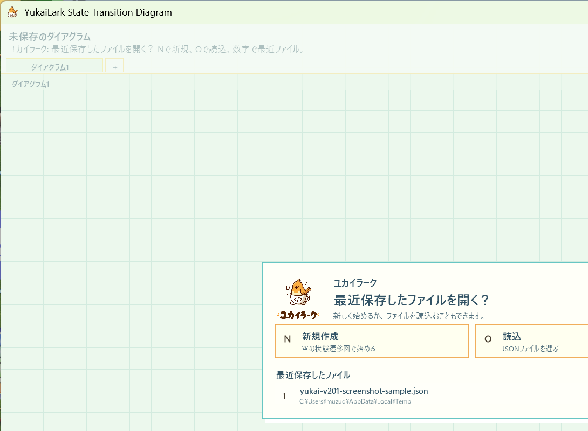

# 開発日誌 2026年7月

2026年7月は、Version 2.0.0 に向けて「1 ファイルに複数の図を持つ」「タブで切り替える」「通常ノードの中へ入る」流れを入れ始め、Version 2.0.1 でサブステートの現在位置表示と既存サブステート紐づけを整えた月です。

## 今月の流れ

- 2026-07-04: 複数ダイアグラム、タブ、サブステート移動をまとめ、`v2.0.0` として公開した。
- 2026-07-05: パンくずリスト、既存サブステート紐づけ、表示位置調整をまとめ、`v2.0.1` として開発日誌化した。

## 日別目次

- [2026-07-04](#2026-07-04)
- [2026-07-05](#2026-07-05)

## 2026-07-04

### v2.0.0 を公開した

- GitHub Releases に `v2.0.0` を公開した。
- 公開ページは <https://github.com/muzudho/YukaiLarkStateTransitionDiagram/releases/tag/v2.0.0>。
- Windows 用 zip は `YukaiLarkStateTransitionDiagram-v2.0.0-win-x64.zip` として案内した。
- リポジトリーのトップ `README.md` も、最新版の導線を `v2.0.0` へ更新した。

### 今回入った大きな変更

- Version 2.0.0 に向けて、今まで 1 枚だった図を `DiagramInstance` として扱う土台を入れた。
- 保存 JSON に複数のダイアグラムを持てる構造を追加し、旧形式の図も読み込めるようにした。
- 画面上部にタブを追加し、複数の図を切り替えられるようにした。
- タブ名を編集できるようにし、日本語のタブ名も保存・読込できることを確認した。
- タブの追加、切り替え、削除をできるようにした。
- 通常ノードからサブステート用のダイアグラムへ入れるようにした。
- サブステートを持つ通常ノードは二重枠で表示するようにした。
- `Alt + Down` で選択中の通常ノードの中へ入り、`Alt + Up` で親の図へ戻れるようにした。
- サブステートの二重枠は、内側だけを塗りつぶす見た目にして、暗いテーマでも枠が同化しにくいようにした。

### 今回の位置づけ

- `v1.0.0` と `v1.0.1` は、1 枚の状態遷移図を作るための基本編集と見た目の仕上げだった。
- `v2.0.0` は、状態の中にさらに図を持てる「サブステート」へ進むための構造変更リリースになった。
- 最初からグローバル遷移まで作り切るのではなく、複数ダイアグラム、タブ、通常ノードとの関連付け、親子移動を順番に固めた。
- Version 1 系の図を壊さないことを重視し、旧 `Data.Nodes` / `Data.Transitions` 形式からルートダイアグラムへ包む読み込みを残した。

### 確認したこと

- サブステート親戻り操作追加後、`dotnet build .\YukaiLarkStateTransitionDiagram.slnx -v:minimal` は警告 0、エラー 0 で成功した。
- 複数タブ保存と、日本語タブ名の読み書きを確認した。
- 通常ノードからサブステートへ入り、`Alt + Up` で親の図へ戻れることを確認した。
- サブステートを持つ通常ノードの二重枠表示を調整し、塗りつぶし位置の 1px 隙間も直した。

### 次にやるなら

- サブステート内から見た、親ノード外向き遷移の扱いを設計する。
- 親子関係が深くなったとき、現在位置が分かりやすいタブ表示やパンくず表示を検討する。
- Version 2 形式で保存した JSON を、使い方説明書にどこまで説明するか決める。
- サブステートを含む図のサンプルスクリーンショットを撮り、README や説明書へ反映する。

## 2026-07-05

### v2.0.1 としてまとめた

- アプリケーションのアセンブリバージョンとファイルバージョンを `2.0.1.0` へ上げた。
- `v2.0.0` で入れたサブステート機能を、使うときに迷いにくいように整理した。
- 今回は大きな保存形式変更ではなく、サブステートをたどる操作と画面上の位置把握を補強する小更新としてまとめた。

### スクリーンショット

起動時のファイルメニューとタブ領域を含む、`v2.0.1` 作業時点の画面。サブステート機能は、この上部タブ領域の下にパンくずリストを重ねて現在位置を示す構成にした。

### 今回入った変更

- サブステートのネスト階層を表すパンくずリストを追加した。
- パンくずリストの各項目をクリックできるようにし、親側や途中階層のダイアグラムへ直接戻れるようにした。
- パンくずリストが長くなったときは、先頭と現在位置を残しつつ途中を `...` で省略するようにした。
- パンくずリストの現在項目だけが強く目立ちすぎないように、ボタン風の塗りを抑え、ホバー時だけ枠を出す見た目へ調整した。
- パンくずリストの背面に半透明の背景帯を置き、図の文字や線と重なっても読めるようにした。
- ユカイラークの表示位置を、パンくずリストと重ならないように下げた。
- インスペクター内のミニマップ位置も、パンくずリストの高さを避けるように調整した。
- 未紐づけの通常ノードから `Ctrl + Alt + Down` で既存ダイアグラム一覧を開き、既存サブステートへ紐づけられるようにした。
- 既存サブステート紐づけでは、現在の図、既に親を持つ図、循環を作る図を候補から外すようにした。
- テキスト入力中に何もない場所をクリックしたとき、編集を解除できるようにした。
- キーリピートまわりの操作感を調整した。

### 今回の位置づけ

- `v2.0.0` は、複数ダイアグラムとサブステートの土台を入れたリリースだった。
- `v2.0.1` は、その土台を使いやすくするための小さな整備版。
- 特に、サブステートが深くなったときに「今どこにいるか」「どこへ戻れるか」を画面上で追えるようにした。
- 既存の Version 2 形式の保存データを壊さず、操作導線と表示の分かりやすさを優先した。

### 確認したこと

- `dotnet build .\YukaiLarkStateTransitionDiagram.slnx -v:minimal` は警告 0、エラー 0 で成功した。
- v2.0.1 用スクリーンショットを `Docs/images/screenshot-v2.0.1-substate-breadcrumb-2026-07-05.png` に保存した。
- スクリーンショット撮影後、撮影用に一時変更したユーザー設定ファイルは元に戻した。

### 次にやるなら

- README のダウンロード導線を、リリース作成後に `v2.0.1` へ更新する。
- 使い方説明書に、パンくずリストのクリック移動と `Ctrl + Alt + Down` の既存サブステート紐づけを追記する。
- サブステートのサンプル JSON と、パンくずリストが見える実例スクリーンショットを説明用に整える。
